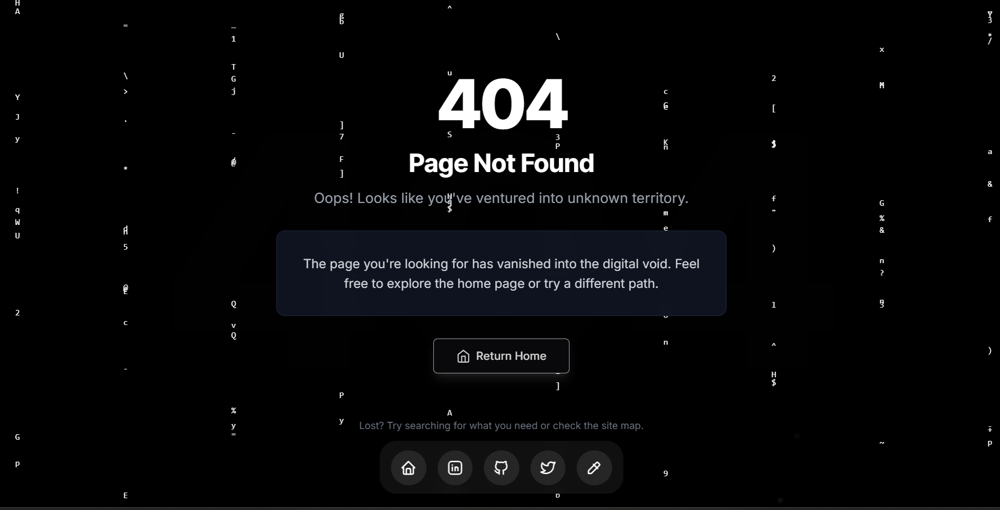

# Vaibhav Kothari's Portfolio Website

A modern, responsive portfolio website built with Next.js and TypeScript, featuring a dark mode interface, interactive animations, and a seamless user experience.

## 🛠️ Tech Stack

- **Framework**: [Next.js 15](https://nextjs.org/)
- **Language**: [TypeScript](https://www.typescriptlang.org/)
- **Styling**: [Tailwind CSS](https://tailwindcss.com/)
- **Animations**: [Framer Motion](https://www.framer.com/motion/)
- **Form Handling**: [React Hook Form](https://react-hook-form.com/)
- **Email Service**: [EmailJS](https://www.emailjs.com/)
- **Icons**: [Lucide Icons](https://lucide.dev/)
- **Validation**: [Zod](https://github.com/colinhacks/zod)
- **UI Components**: Custom components with shadcn/ui

## 📄 License

This project is licensed under the MIT License - see the [LICENSE](LICENSE) file for details.

## 👤 Author

**Vaibhav Kothari**
- Twitter: [@VaibhavKotharii](https://twitter.com/VaibhavKotharii)
- LinkedIn: [vaibhavkothari33](https://www.linkedin.com/in/vaibhavkothari33/)
- GitHub: [@vaibhavkothari33](https://github.com/vaibhavkothari33)

## 💖 Support

If you find this project helpful, please consider giving it a ⭐️ on GitHub and supporting me:

---

Made with ❤️ by [Vaibhav Kothari](https://vaibhavkothari.vercel.app/)
